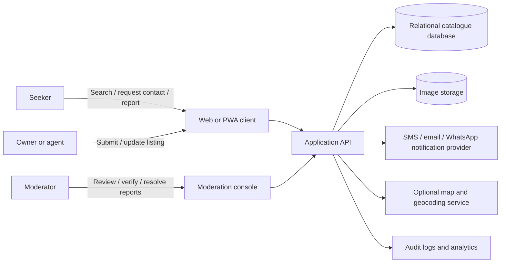
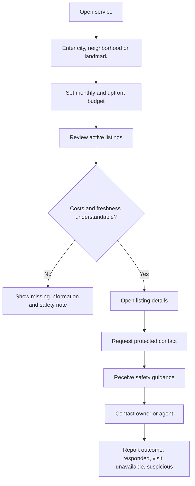
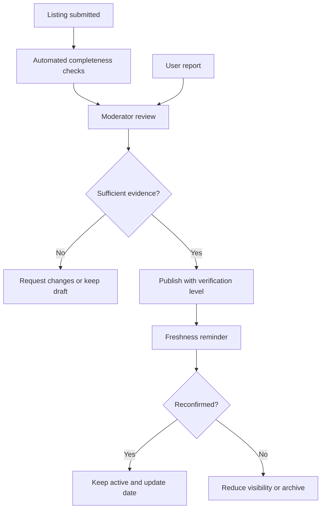
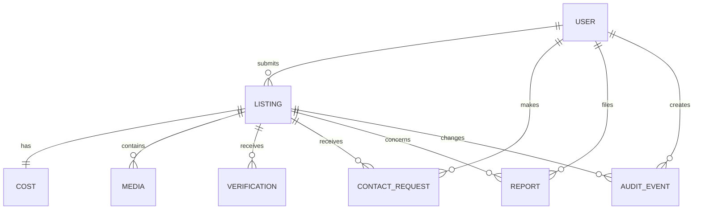

# Software Requirements Specification (SRS)
## Affordable Housing Cameroon — Lean MVP

**Document status:** Version 1.0 — zero-capital and 100,000 XAF planning baseline  
**Language:** English  
**Primary launch context:** Cameroon, beginning with one narrow neighborhood cluster and later expanding to Yaoundé and Douala  
**Prepared for:** Founder, product, design, engineering, field operations, and potential partners  

---

## 1. Executive decision

With **0 XAF available today** and a possible **100,000 XAF later**, the project should not begin by building a full marketplace. It should begin as a **manual housing-matching and verification service** using free tools, then convert validated workflows into software.

The first release is therefore divided into two stages:

| Stage | Capital assumption | Product form | Main purpose |
|---|---:|---|---|
| Stage A: validation service | 0–100,000 XAF | WhatsApp, phone, free forms, spreadsheet, manual moderation | Prove that a specific group of renters will use the service and that credible listings can be maintained |
| Stage B: lean software MVP | External funding required | Mobile-first web app, catalogue, protected contact, moderation console | Reduce manual work and make the validated process repeatable |

The core product promise is:

> Help a renter discover a potentially real home, understand the total cost of entering it, and request a safer contact without paying prematurely.

The system must not promise that every listing is legally certified, perfectly safe, or permanently available. Verification levels and uncertainty must be explicit.

## 2. Problem statement

Housing seekers often encounter incomplete prices, outdated availability, informal directions, unclear fees, unresponsive contacts, and fraud risk. A traditional listing board can increase the quantity of information without improving the quality of a housing decision.

The MVP must focus on **cost transparency, freshness, local discovery, and trust operations**. “Affordable” must be represented through total entry cost and recurring cost, not monthly rent alone.

The initial context is urban Cameroon, where local search may depend on neighborhoods, landmarks, roads, schools, markets, and transport routes in addition to formal addresses. The product should support both English and French in its operating model, even if the first user interface is English-first.

## 3. Objectives and success criteria

### 3.1 Product objectives

The MVP shall:

1. Let a seeker search active listings by city, neighborhood, landmark, budget, housing type, and availability.
2. Show rent, advance, deposit, fees, utilities, and unknown costs separately.
3. Show freshness and verification signals in plain language.
4. Allow a seeker to request contact without exposing every phone number publicly.
5. Allow owners or agents to submit listings through a guided process.
6. Give moderators a queue to review, publish, refresh, suspend, and archive listings.
7. Capture enough data to measure the path from search to contact and visit.

### 3.2 Validation success before software investment

Do not proceed to funded development until the manual phase produces evidence for the following:

| Gate | Minimum evidence to seek |
|---|---|
| Demand | At least 20 qualified seekers have described the same urgent housing problem |
| Supply | At least 30 owners or agents are willing to submit or confirm listings |
| Usability | At least 10 seekers can understand total entry cost without coaching |
| Trust | Users can explain what is verified and what remains uncertain |
| Operations | The founder can refresh, correct, and remove listings using a repeatable checklist |
| Value | Several users request additional listings, referrals, or follow-up help |

These are validation targets, not guaranteed outcomes. The founder should revise them after the first interviews.

## 4. Scope

### 4.1 In scope for Stage A: zero-capital validation

Stage A is a service experiment, not a software product. It may use a WhatsApp Business account, a free online form, a spreadsheet, a free design tool, and a simple public information page. It should collect only the minimum personal information required to respond.

The founder manually receives seeker requirements, captures listings, calls or messages the supply-side contact, records verification status, sends a small number of relevant options, and records what happened. No one should be asked to pay to access a listing during this phase.

### 4.2 In scope for Stage B: lean software MVP

The funded MVP includes a public listing catalogue, search and filters, listing detail pages, cost-of-entry display, freshness signals, guided listing submission, contact requests, reporting, moderation, basic analytics, bilingual content capability, and role-based administration.

### 4.3 Out of scope for the first MVP

The following are explicitly deferred:

| Deferred feature | Reason |
|---|---|
| Rent collection, escrow, or payment processing | High legal, financial, fraud, and operational complexity |
| Guaranteed ownership or title verification | Requires specialist legal and field processes |
| National coverage | Would increase supply and moderation risk before the model is proven |
| AI recommendations | Not required before clean usage data exists |
| Native Android and iOS apps | A responsive web app is cheaper to validate |
| Automated fraud scoring | Begin with human moderation and clear rules |
| Open public phone-number directory | Increases spam and privacy risk |
| Complex landlord/property-management software | Not necessary for the first renter journey |

## 5. Stakeholders and user roles

| Role | Main need | Permissions or responsibilities |
|---|---|---|
| Seeker | Find a suitable, credible, affordable home | Search, save, request contact, report, provide feedback |
| Owner | Publish and maintain accurate availability | Submit, update, confirm, and withdraw listings |
| Agent | Manage multiple listings responsibly | Submit listings, respond to requests, maintain contact identity |
| Moderator | Protect catalogue quality and users | Review, verify, publish, suspend, archive, investigate reports |
| Founder/operator | Learn and manage the service | Configure rules, inspect metrics, handle escalations |
| Partner | Refer users or provide legitimate supply | Share approved information under defined terms |

## 6. Stage A manual operating requirements

The manual phase is the most important requirement under the current funding constraint.

### A-REQ-01: Seeker intake

The operator shall collect, at minimum, preferred city or neighborhood, maximum monthly rent, maximum upfront amount, housing type, move-in timing, household size, and preferred contact channel.

### A-REQ-02: Listing intake

The operator shall collect owner or agent name, phone number, listing location, landmark, housing type, monthly rent, advance, deposit, fees, utilities if known, availability date, photos if available, and permission to share the information.

### A-REQ-03: Verification record

Each listing shall have a verification status, last-confirmed date, verification method, missing-information note, and next follow-up date.

### A-REQ-04: Manual matching

The operator shall match seekers only with listings whose budget and availability information are sufficiently complete. The operator shall clearly label unknown costs and shall not imply a guarantee.

### A-REQ-05: Safety warning

Before the operator shares a contact or visit instruction, the seeker shall receive a short warning not to send money before independently confirming the property and terms.

### A-REQ-06: Outcome tracking

The operator shall record whether the seeker opened the option, contacted the supply-side person, visited, found the listing inaccurate, or requested further help.

### A-REQ-07: No-paywall principle

The validation phase shall not require seekers to pay to access basic housing information. Any later revenue model must be tested separately and must not undermine safety or access.

## 7. Functional requirements for Stage B MVP

### 7.1 Account and identity

| ID | Requirement | Priority |
|---|---|---|
| FR-AUTH-01 | The system shall allow public users to browse active listings without creating an account. | Must |
| FR-AUTH-02 | The system shall support account creation using phone number or email, subject to an agreed verification method. | Should |
| FR-AUTH-03 | The system shall assign roles for seeker, owner/agent, moderator, and administrator. | Must |
| FR-AUTH-04 | The system shall prevent unauthorized users from viewing moderator tools or private contact details. | Must |

### 7.2 Search and discovery

| ID | Requirement | Priority |
|---|---|---|
| FR-SEARCH-01 | The system shall search by city, neighborhood, landmark, and free-text location description. | Must |
| FR-SEARCH-02 | The system shall filter by housing type, bedrooms or rooms, monthly rent, upfront cost, availability, furnished status, utilities, and verification level. | Must |
| FR-SEARCH-03 | The system shall show a list view that remains useful when maps or geolocation are unavailable. | Must |
| FR-SEARCH-04 | The system shall sort results by relevance, freshness, affordability fit, and distance when location data is reliable. | Should |
| FR-SEARCH-05 | The system shall display an empty state with suggestions when no results match. | Must |
| FR-SEARCH-06 | The system shall display the date on which a listing was last confirmed. | Must |

### 7.3 Cost transparency

| ID | Requirement | Priority |
|---|---|---|
| FR-COST-01 | The system shall store monthly rent separately from advance, deposit, agency fee, service fee, utilities, and other charges. | Must |
| FR-COST-02 | The system shall calculate a visible estimated total entry cost when required fields are known. | Must |
| FR-COST-03 | The system shall show “Not provided” for missing costs rather than assuming zero. | Must |
| FR-COST-04 | The system shall allow a seeker to filter by maximum monthly rent and maximum upfront amount. | Must |
| FR-COST-05 | The system shall display a disclaimer that estimates may change until confirmed with the owner or agent. | Must |

### 7.4 Listing detail and supply submission

| ID | Requirement | Priority |
|---|---|---|
| FR-LIST-01 | The system shall display photos, housing type, location description, price fields, availability, amenities, freshness, and verification information. | Must |
| FR-LIST-02 | The system shall allow owners or agents to submit a listing through a guided form. | Must |
| FR-LIST-03 | The system shall prevent a listing from becoming public before moderation review. | Must |
| FR-LIST-04 | The system shall allow the owner or agent to confirm or withdraw a listing. | Must |
| FR-LIST-05 | The system shall expire or reduce visibility for listings that are not reconfirmed within the configured freshness period. | Must |
| FR-LIST-06 | The system shall allow moderators to merge or suspend duplicate listings. | Must |

### 7.5 Contact and visit flow

| ID | Requirement | Priority |
|---|---|---|
| FR-CONTACT-01 | A seeker shall be able to request contact from a listing page. | Must |
| FR-CONTACT-02 | The system shall protect private contact details from unrestricted public scraping. | Must |
| FR-CONTACT-03 | The system shall record contact-request status: requested, delivered, responded, visit planned, completed, failed, or disputed. | Must |
| FR-CONTACT-04 | The system shall show a safety warning before a seeker proceeds to payment or an in-person visit. | Must |
| FR-CONTACT-05 | The system shall allow the seeker to report an inaccurate, abusive, fraudulent, or unavailable listing. | Must |

### 7.6 Trust and moderation

| ID | Requirement | Priority |
|---|---|---|
| FR-TRUST-01 | The system shall provide verification levels with plain-language definitions. | Must |
| FR-TRUST-02 | The system shall record who performed a verification action and when. | Must |
| FR-TRUST-03 | The system shall provide a moderation queue for new listings, reports, freshness checks, and escalations. | Must |
| FR-TRUST-04 | The system shall allow a moderator to publish, request changes, suspend, archive, and restore a listing. | Must |
| FR-TRUST-05 | The system shall retain an audit event for material changes to a listing or user status. | Must |
| FR-TRUST-06 | The system shall rate-limit repetitive submissions and contact requests. | Should |

### 7.7 Reporting and analytics

| ID | Requirement | Priority |
|---|---|---|
| FR-ANALYTICS-01 | The system shall count searches, listing views, contact requests, responses, visits, reports, and listing outcomes. | Must |
| FR-ANALYTICS-02 | The system shall allow operators to distinguish active, stale, suspended, and archived listings. | Must |
| FR-ANALYTICS-03 | The system shall avoid collecting unnecessary personal data in analytics events. | Must |
| FR-ANALYTICS-04 | The system shall provide a weekly operational summary for catalogue health and trust incidents. | Should |

## 8. Non-functional requirements

### 8.1 Accessibility and usability

The interface shall use readable text, clear contrast, visible keyboard focus, descriptive labels, meaningful error messages, and a list view that does not depend on a map. Core tasks shall be testable in English first and prepared for French localization.

### 8.2 Performance and connectivity

The MVP shall be mobile-first and optimized for low-end devices. Images shall be compressed. The main listing experience should remain usable on a slow mobile connection. If a map, image, or optional enhancement fails, the user shall still be able to read the listing and request contact.

### 8.3 Security and privacy

The system shall use role-based access, secure password or token handling, protected contact information, server-side validation, rate limiting, audit logs, and encrypted transport. The system shall collect only data needed for the stated service. Personal-data processing should be reviewed against Cameroon’s Law No. 2024/017 before public launch [3].

### 8.4 Reliability and maintainability

The system shall have automated backups, error monitoring, documented deployment steps, a staging environment, and a rollback process. Code shall be organized so that search, cost calculations, listing state, moderation, and contact workflows can be tested independently.

### 8.5 Localization

The domain model shall support English and French labels, local currency in XAF, local phone-number formats, neighborhood and landmark descriptions, and future local-language support where operationally justified.

## 9. Data requirements

### 9.1 Core entities

| Entity | Required fields |
|---|---|
| User | id, role, name or display name, phone/email, verification state, created date, status |
| Listing | id, owner/agent id, title, type, city, neighborhood, landmark, description, availability, status, created date, updated date |
| Cost | listing id, monthly rent, advance, deposit, agency fee, service fee, utilities, other charges, currency, completeness state |
| Media | listing id, file URL, type, caption, moderation state, uploaded date |
| Verification | listing id, level, method, evidence note, moderator id, checked date, next-check date |
| Contact request | seeker id, listing id, status, requested date, response date, visit status, outcome |
| Report | reporter id, listing id or user id, category, description, status, moderator, resolution |
| Audit event | actor id, entity, action, previous value summary, new value summary, timestamp |

### 9.2 Listing state machine

A listing shall move through the following states:

`Draft → Under review → Published → Needs reconfirmation → Published`

It may also move from any active state to `Suspended` or `Archived`. A suspended listing must not appear in public search. An archived listing remains available to operators for audit but is not presented as active supply.

## 10. Trust model

The MVP should use understandable verification levels instead of a single vague “verified” label.

| Level | Meaning |
|---|---|
| Contact confirmed | The contact channel was reached and associated with the listing submission |
| Details reviewed | A moderator checked required price, location, and availability fields |
| Recently reconfirmed | The responsible contact confirmed that the listing was still active within the freshness period |
| Field-checked | A defined local process recorded a physical or partner-based check; this must not imply legal title certification |

Every label must link to an explanation. If the platform cannot perform a check, it must not imply that it did.

## 11. Recommended architecture

### 11.1 Stage A architecture

Use free or existing communication channels and a simple controlled data register. The operator should avoid copying sensitive information into multiple uncontrolled places. A single source of truth should contain listing status, verification notes, dates, and outcomes.

### 11.2 Stage B architecture

The lean funded MVP should use a responsive web client, secure application API, relational database, object storage for images, notification provider, and moderation console. A managed platform is preferable to self-hosting while capital is limited, provided costs and data-processing terms are understood.

### 11.3 System context diagram

### 11.4 Core seeker workflow

### 11.5 Moderation workflow

### 11.6 Minimal data relationship diagram

## 12. Funding-aware implementation roadmap

### Phase 0: 0 XAF — prove the problem

The founder interviews seekers and supply-side contacts, defines the first segment, creates a manual intake form, gathers a small number of listings, and records outcomes. The deliverable is evidence, not software.

### Phase 1: up to 100,000 XAF — run a tiny manual pilot

If the capital becomes available, use it for transport, phone/data, participant support, printing or local outreach, and field verification. Do not spend it on a custom app, logo redesign, paid advertising, or national coverage.

| Use of 100,000 XAF | Indicative allocation |
|---|---:|
| Transport for selected field visits | 35,000 XAF |
| Phone/data and calling | 25,000 XAF |
| Small participant or partner appreciation | 20,000 XAF |
| Printing or simple outreach materials | 10,000 XAF |
| Emergency reserve | 10,000 XAF |
| **Total** | **100,000 XAF** |

These amounts are a planning example and should be adapted to actual local prices. If travel is not necessary, move the saving to data, communication, or reserve.

### Phase 2: funded MVP

Begin software development only after the validation gates in Section 3 are substantially met. The first funded release should implement the requirements marked **Must** and should retain human moderation.

## 13. Acceptance criteria

The MVP is acceptable for a controlled pilot when all of the following are true:

1. A public user can search by neighborhood or landmark and read active listing details without logging in.
2. A seeker can see monthly rent, known upfront costs, unknown values, and the estimated total entry cost.
3. No unreviewed listing can appear as published.
4. A moderator can publish, request changes, suspend, archive, and refresh a listing.
5. A listing clearly displays its verification level and last-confirmed date.
6. A seeker can request contact without unrestricted public exposure of the contact database.
7. A user can report a listing and a moderator can see and resolve the report.
8. The system records the core funnel events without unnecessary personal data.
9. The service remains usable on a mobile device when maps or optional images fail.
10. English content is complete and the data model is prepared for French localization.
11. Safety warnings appear before the user is encouraged to transfer money or attend a visit.
12. A backup, access-control, incident-response, and listing-removal procedure has been tested.

## 14. Risks and mitigations

| Risk | Impact | Mitigation |
|---|---|---|
| False or stale listings | Loss of trust | Freshness expiry, manual confirmation, suspension |
| Advance-payment fraud | User harm and reputational damage | Clear warnings, protected contact flow, report escalation |
| Too little supply | Poor search experience | Start with selected neighborhoods and recruit partners before promotion |
| Scope expansion | Capital exhaustion | Must/Should/Could priorities and funding gates |
| Sensitive personal data exposure | Legal and safety risk | Data minimization, role access, retention rules, local legal review |
| Low connectivity | Excluded users | Compressed media, list-first design, graceful degradation |
| Founder overload | Inconsistent operations | Use a repeatable checklist and limit the pilot size |

## 15. Immediate next actions

For the next seven days, do not hire developers. Select one first segment, choose one neighborhood cluster, interview seekers and supply contacts, create the manual intake sheet, and collect the first 10–20 candidate listings. Record every missing cost, wrong direction, stale listing, and trust concern.

At the end of that week, decide whether the problem is specific enough to continue. If yes, operate the manual service for several weeks. Only then should the founder use the SRS to request technical quotes or seek funding.

## References

[1]: https://housingfinanceafrica.org/country-detail/cameroon/ "Centre for Affordable Housing Finance in Africa — Cameroon country detail"

[2]: https://unhabitat.org/cameroon "UN-Habitat — Cameroon country profile"

[3]: https://prc.cm/en/multimedia/documents/10271-law-n-2024-017-of-23-12-2024-web "Presidency of the Republic of Cameroon — Law No. 2024/017 relating to personal data protection"
